# Procesverslag
**Auteur:** - Aleid Vliegers -

**De opdrachten:** [opdracht 1](opdracht1/index.html) en [opdracht 2](opdracht2/index.html)

Markdown is een simpele manier om HTML te schrijven.  
Markdown cheat cheet: [Hulp bij het schrijven van Markdown](https://github.com/adam-p/markdown-here/wiki/Markdown-Cheatsheet).

Nb. De standaardstructuur en de spartaanse opmaak van de README.md zijn helemaal prima. Het gaat om de inhoud van je procesverslag. Besteedt de tijd voor pracht en praal aan je website.

Nb. Door *open* toe te voegen aan een *details* element kun je deze standaard open zetten. Fijn om dat steeds voor de relevante stuk(ken) te doen.

## Bronnenlijst
  1. https://www.fontspace.com/abeatbykai-font-f11363
  2. https://codepen.io/shooft/pen/gOdbPKV
  3. https://tobiasahlin.com/blog/layered-smooth-box-shadows/
  4. https://developer.mozilla.org/en-US/docs/Web/JavaScript/Reference/Operators/void
  5. https://www.w3schools.com/js/js_arrays.asp
  6. https://www.1001fonts.com/tex-gyre-adventor-font.html
  7. https://fonts.google.com/specimen/Sacramento
  8. https://fonts.google.com/specimen/Poppins
  9. https://bennettfeely.com/clippy/
  10.https://github.com/mathieudutour/confetti.js
  11.https://codepen.io/shooft/pen/yLxzgzP

## Opdracht 1 plan

  
uitwerken na schetsen idee (voor week 2)

  ### Je storyboard:
  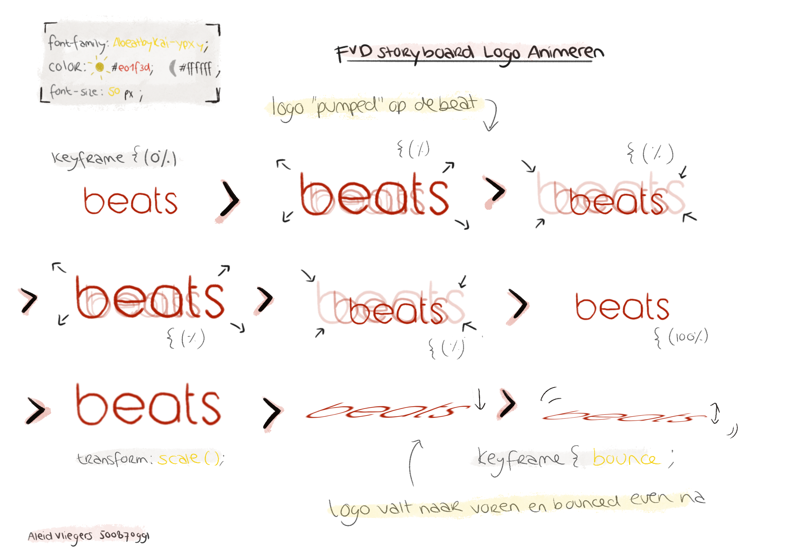

  ### Je ambitie: 
  Aan deze technieken/punten wil ik werken:
  - Keyframes toepassen
  - Het veel gebruik maken van de transform property
  - Uitvinden wat mogelijk is met ::before & ::after
 

## Opdracht 1 reflectie

  
uitwerken bij afronden opdracht (voor week 4)

  ### Je uitkomst - karakteristiek screenshot(s):
  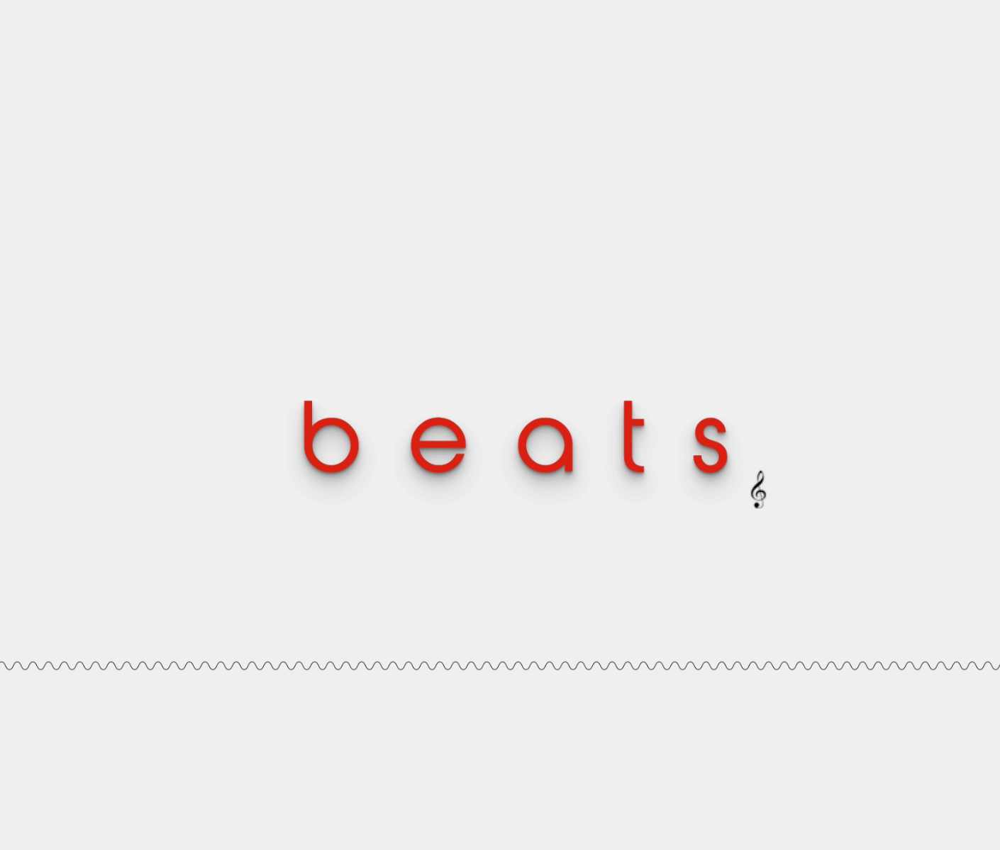
  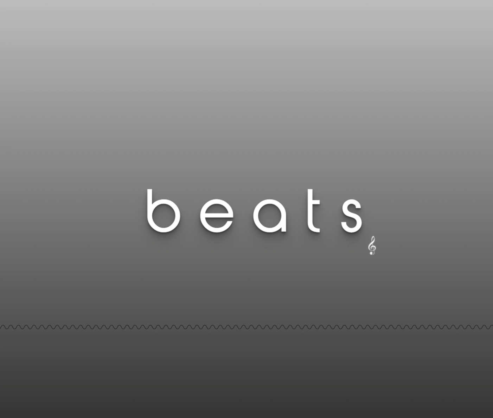

  ### Dit ging goed/Heb ik geleerd: 
  Korte omschrijving met plaatje(s)

  > het pulserende effect dat ik aan mijn logo heb willen geven met @keyframes is gemakkelijk gegaan.
  > het is me gelukt om de tekst te laten omvallen met @keyframes.
  > ik heb geleerd hoe je door het kleurenwiel gaat en een element meerdere kleuren geeft dmv van een filter.
  > ik heb geleerd hoe je op de meest correcte manier (voor deze opdracht) een font importeerd.
  > ik heb geleerd dat je met ::after & ::before elementen achter en voor een ander element kunt zetten en hoe je dit kunt stylen.
  > de theorie van de lessen begrijpen ging goed.

  
  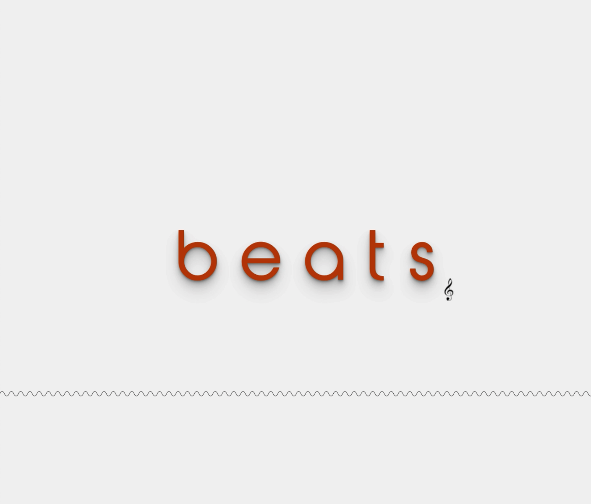
  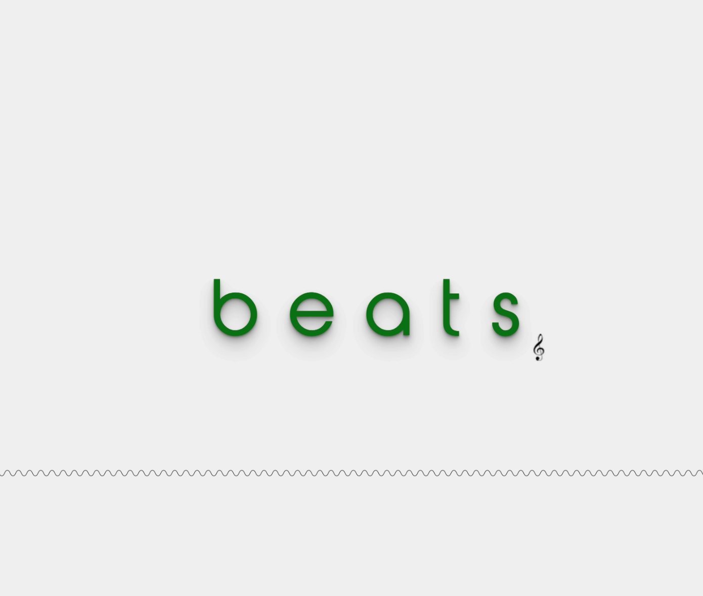
  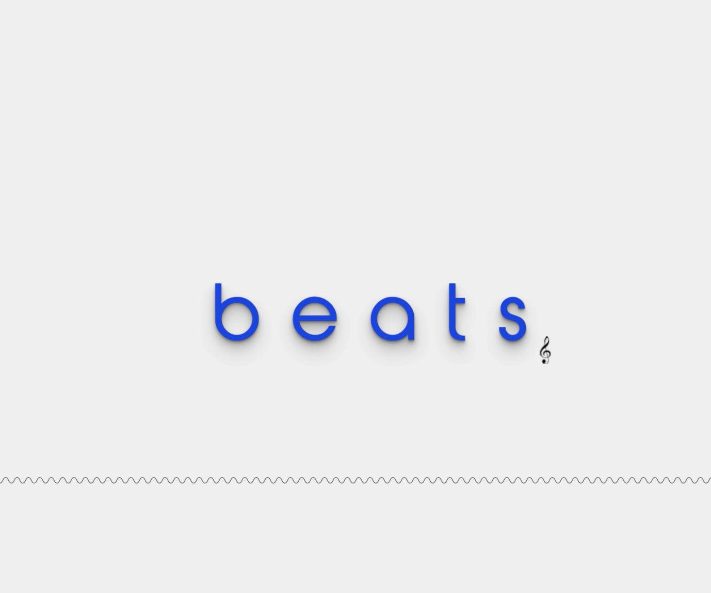
  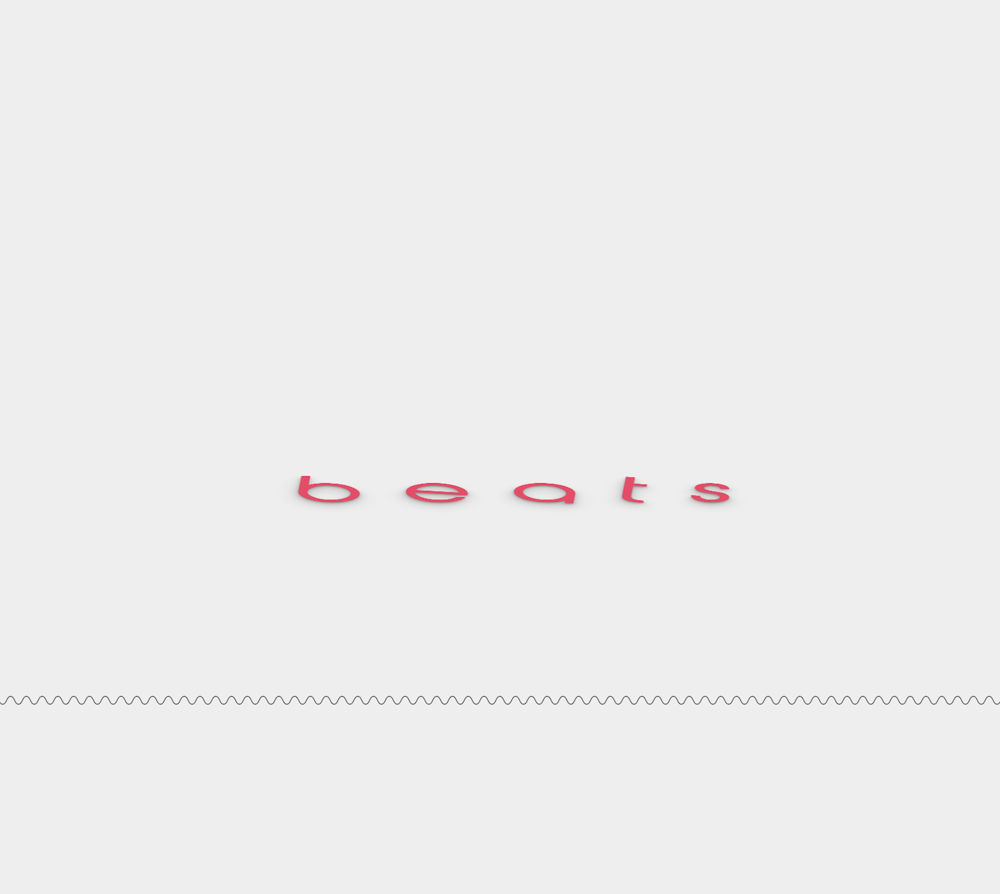
  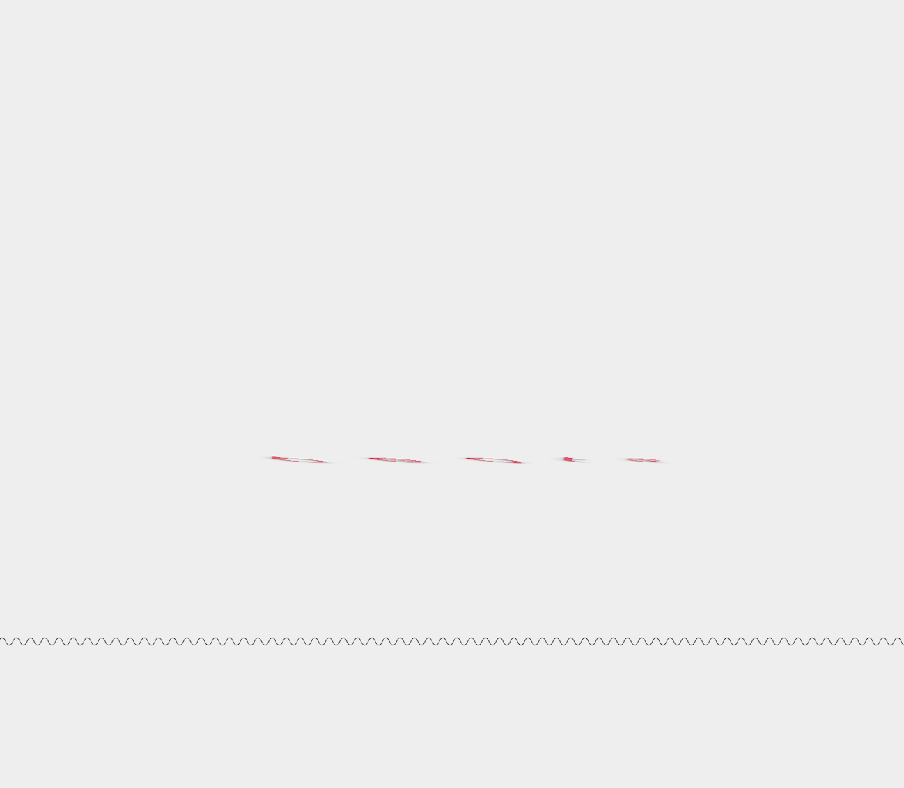

  ### Dit was lastig/Is niet gelukt:
  Korte omschrijving met plaatje(s)

  > ik heb op meerdere manieren geprobeerd om een pulserende lijn als ::after neer te zetten.
  > o.a. door een background-image met een gradient, door een text decoration: underline wavy en transparante text en door het stijlen van een svg in de content maar geen een manier hiervan is mij gelukt.
  > ik heb geprobeerd audio te importeren dat pas afspeelt wanneer er over heen wordt gehoverd, dit is niet gelukt.

## Opdracht 2 plan

  
uitwerken na schetsen idee (voor week 5)

  ### Je ontwerp:
  

  ### Je ambitie: 
  Aan deze technieken/punten wil ik werken:
  - Javascript in geheel
  - De pagina toegankelijk maken met toetsenbord bediening
  - Media queries voor responsiveness
  - Speech API
  - JS transities

## Opdracht 2 test

  
uitwerken na testen (week 7)

  Neem minimaal 5 bevindingen op:

  ### Bevinding 1:
  Omschrijving van wat er nog niet orde was (tekst en afbeeding(en)).

  #### oplossing:
  Beschrijving hoe je het hebt hebt opgelost of als het niet gelukt is hoe je het zou oplossen (tekst en afbeeding(en)).

  ### Bevinding 2:
  Omschrijving van wat er nog niet orde was (tekst en afbeeding(en)).

  #### oplossing:
  Beschrijving hoe je het hebt hebt opgelost of als het niet gelukt is hoe je het zou oplossen (tekst en afbeeding(en)).

  ### Bevinding 3:
  ...

## Opdracht 2 reflectie

  
uitwerken bij afronden opdracht (voor week 8)

  ### Je uitkomst - karakteristiek screenshot(s):
  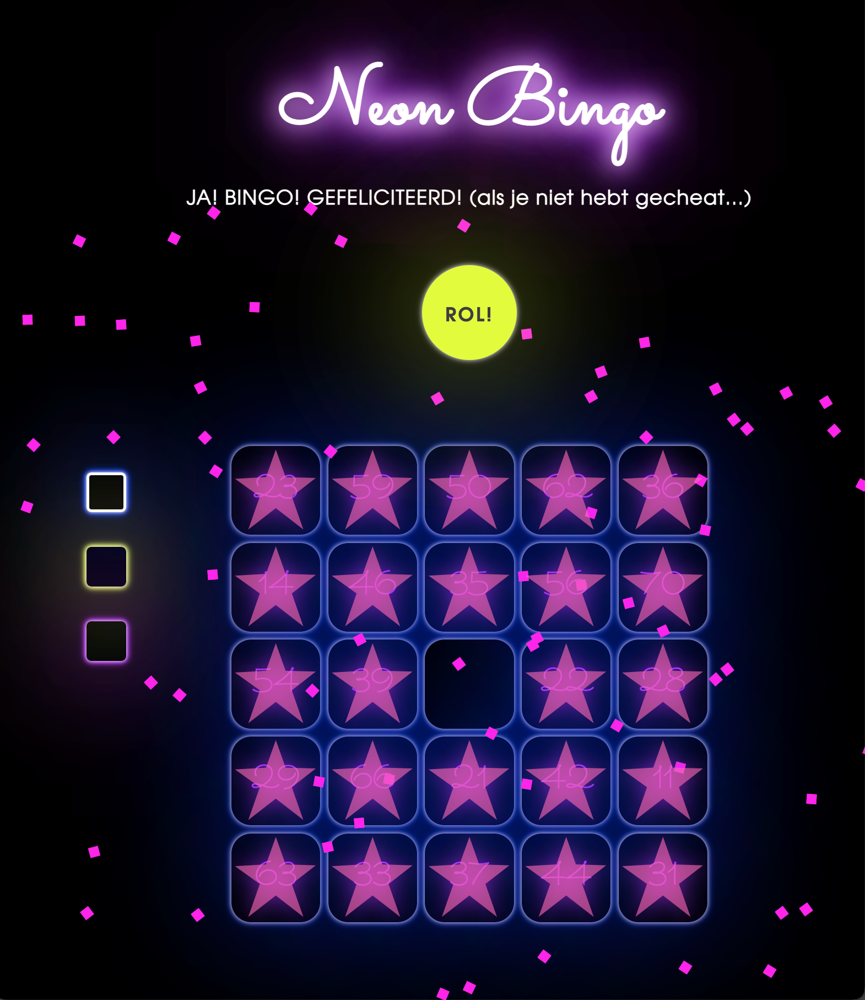

  ### Dit ging goed/Heb ik geleerd: 
  Korte omschrijving met plaatje(s)

  > bingo kaart gemaakt
  > speach api
  > confetti
  > button animatie

  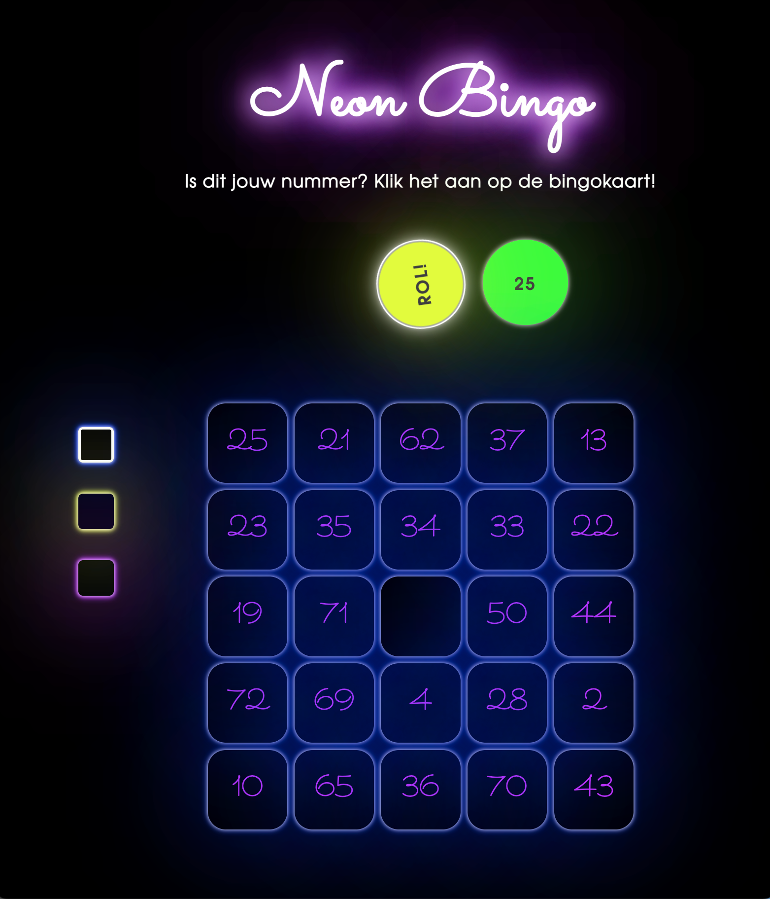

  ### Dit was lastig/Is niet gelukt:
  Korte omschrijving met plaatje(s)

  > de eerste keer na klikken de bal doorzichtig maken
  > fiche er op laten vallen

  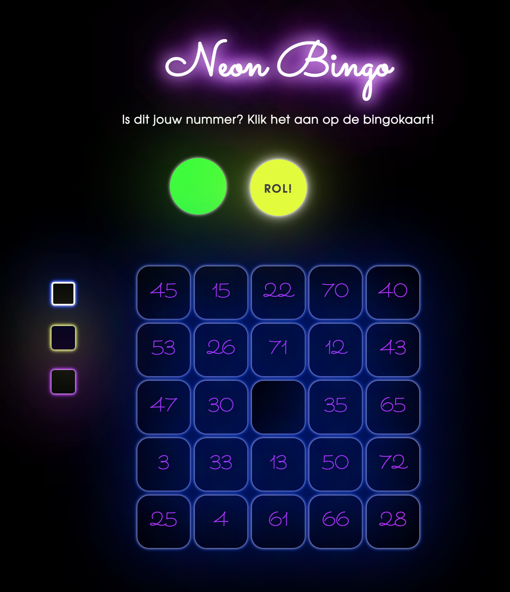
  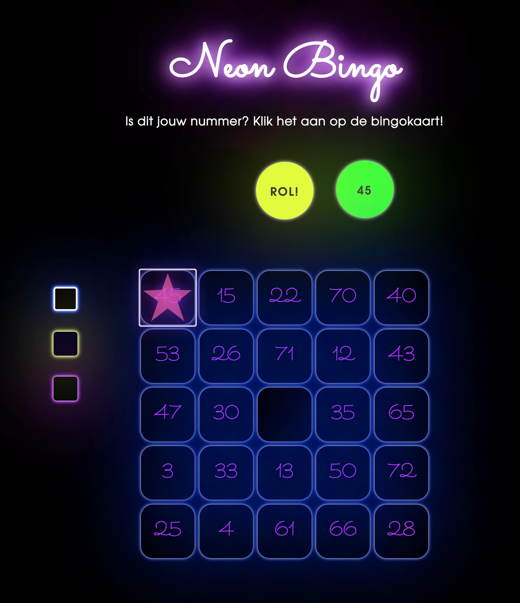

